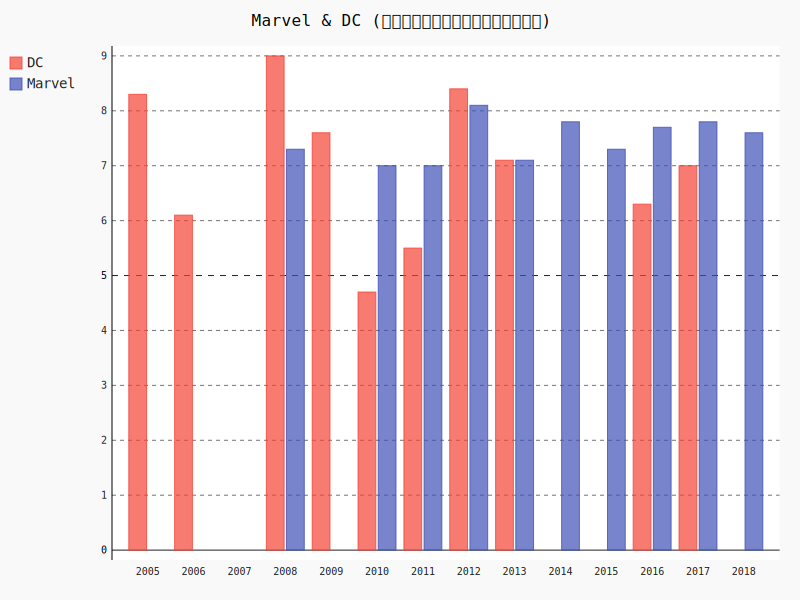
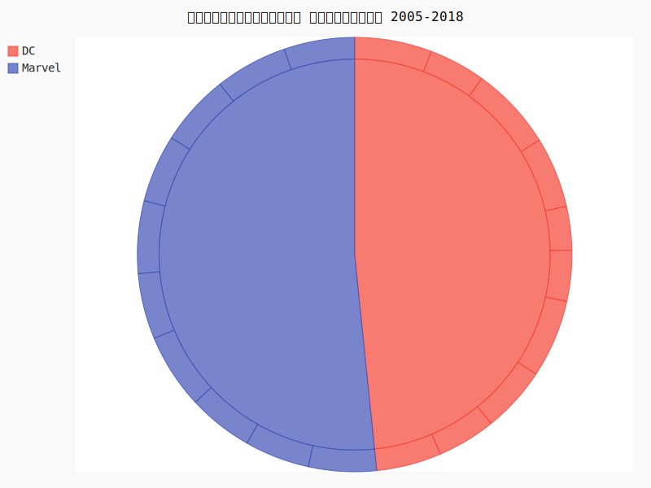
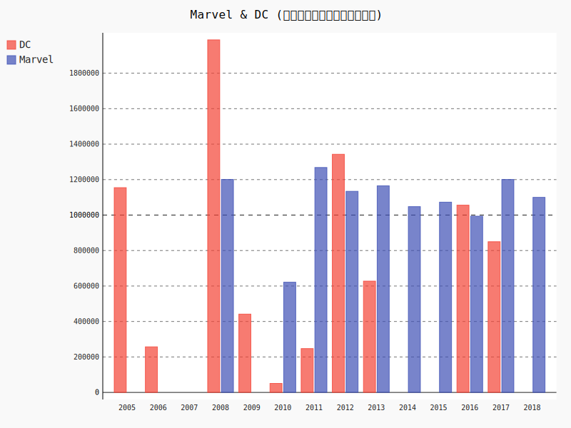
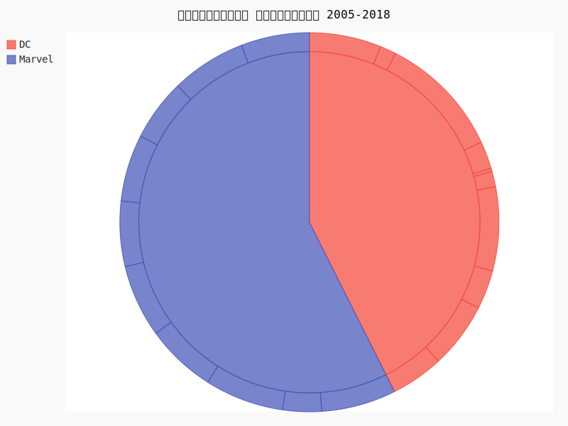

# Project PSIT(Marvel & DC)

# วัตถุประสงค์
-วิเคราะห์ข้อมูลสถิติผู้เข้าชมที่เข้าโรงหนังใน สหรัฐอเมริกา ในแต่ละปี

# ผู้จัดทำ
-คชทัฬห์ ชาติเชยแดง (คอปเตอร์) 61070339

-อังวรา  เป้าหลักแหลม (ฟ้า) 61070351

-ภาณุพงศ์ สูงวิริยะ (บอย) 61070345

# The purpose of the project
โปรเจคนี้จัดทำขึ้นเพื่อ วิเคราะห์ความแตกต่าง ของข้อมูลจำนวนผู้เข้าชมภาพยนต์ของ**เครือ DC** และ **เครือMarvel** ซึ่งทั้งสองเป็นภาพยนตร์ชุดแนวซูเปอร์ฮีโรสัญชาติอเมริกัน
ว่าเพราะเหตุใด ภาพยนต์ของเครือMarvel ถึงมีความนิยมมากกว่า DC

# List of Marvel movies
-  มหาประลัยคนเกราะเหล็ก(Iron Man)
-  มนุษย์ตัวเขียวจอมพลัง(The Incredible Hulk)
-  มหาประลัยคนเกราะเหล็ก 2(Iron Man 2)
-  ธอร์ เทพเจ้าสายฟ้า(Thor)
-  กัปตันอเมริกา: อเวนเจอร์ที่ 1(Captain America: The First Avenger)
-  ดิ อเวนเจอร์ส(The Avengers)
-  มหาประลัยคนเกราะเหล็ก 3(Iron Man 3)
-  ธอร์ เทพเจ้าสายฟ้าโลกาทมิฬ(Thor: The Dark World)
-  กัปตันอเมริกา: มัจจุราชอหังการ(Captain America: The Winter Soldier)
-  อเวนเจอร์ส: มหาศึกอัลตรอนถล่มโลก(Avengers: Age of Ultron)
-  มนุษย์มดมหากาฬ(Ant-Man)
-  กัปตันอเมริกา: ศึกฮีโร่ระห่ำโลก(Captain America: Civil War)
-  จอมเวทย์มหากาฬ(Doctor Strange)
-  รวมพันธุ์นักสู้พิทักษ์จักรวาล 2(Guardians of the Galaxy Vol. 2)
-  สไปเดอร์แมน: โฮมคัมมิ่ง(Spider-Man: Homecoming)
-  ธอร์: ศึกอวสานเทพเจ้า(Thor: Ragnarok)
-  แบล็ค แพนเธอร์(Black Panther)
-  อเวนเจอร์ส: มหาสงครามล้างจักรวาล(Avengers: Infinity War)
-  แอนท์-แมน และ เดอะ วอสพ์(Ant-Man and the Wasp)

# List of DC Comics movies
-  แบทแมน บีกินส์(Batman Begins)
-  ซูเปอร์แมน รีเทิร์น(Superman Returns)
-  แบทแมน อัศวินรัตติกาล(The Dark Knight)
-  ศึกซูเปอร์ฮีโร่พันธุ์มหากาฬ(Watchmen)
-  โจนาห์ เฮ็กซ์ ฮีโร่หน้าบากมหากาฬ(Jonah Hex)
-  กรีน แลนเทิร์น(Green Lantern)
-  แบทแมน อัศวินรัตติกาลผงาด(The Dark Knight Rises)
-  บุรุษเหล็กซูเปอร์แมน(Man of Steel)
-  แบทแมน ปะทะ ซูเปอร์แมน แสงอรุณแห่งยุติธรรม(Batman v Superman: Dawn of Justice)
-  ทีมพลีชีพ มหาวายร้าย(Suicide Squad)
-  เดอะ เลโก้ แบทแมน มูฟวี่(The Lego Batman Movie)
-  วันเดอร์ วูแมน(Wonder Woman)
-  จัสติซ ลีก(Justice League)

 [Marvel & DC (เรตติ้งในแต่ละปี)](http://www.it.kmitl.ac.th/~it61070339/PIC/rate_bar.svg)

 [Marvel & DC (เรตติ้งรวมทุกปี)](http://www.it.kmitl.ac.th/~it61070339/PIC/rate_pie.svg)
 

 [Marvel & DC (คนดูในแต่ละปี)](http://www.it.kmitl.ac.th/~it61070339/PIC/view_bar.svg)
  

 [Marvel & DC (คนดูในรวมทุกปี)](http://www.it.kmitl.ac.th/~it61070339/PIC/view_pie.svg)
   

# หมายเหตุ
- [Python.py](https://github.com/ICopKungI/Project-PSIT/blob/master/Python.py) เป็นไฟล์ code python ต้นแบบก่อนที่จะมีการปรับปรุง
- [Python V.1.py](https://github.com/ICopKungI/Project-PSIT/blob/master/Python%20V.1.py).py เป็นไฟล์ code python โดยรวมของ Project มีการแสดงเป็นตาราง และ กราฟ เมื่อสั่งทำงาน
- [Python V.2.py](https://github.com/ICopKungI/Project-PSIT/blob/master/Python%20V.2.py) เป็นไฟล์ code python ที่สรุปมาจาก Python V.1.py และ เมื่อสั่งทำงานจะแสดงเฉพาะกราฟ
- [rate_of_dc.csv](https://github.com/ICopKungI/Project-PSIT/blob/master/rate_of_dc.csv) เป็นไฟล์ ข้อมูลของDC ของ Project ที่จะนำมาใช้งาน
- [rate_of_marvel.csv](https://github.com/ICopKungI/Project-PSIT/blob/master/rate_of_marvel.csv) เป็นไฟล์ ข้อมูลของMarvel ของ Project ที่จะนำมาใช้งาน
- [rate_bar.svg](https://github.com/ICopKungI/Project-PSIT/blob/master/rate_bar.svg) เป็นไฟล์ กราฟเรตติ้งแบบแท่ง ที่บอกเรตติ้งในแต่ะปีตั้งแต่ปี 2005-2018
- [rate_pie.svg](https://github.com/ICopKungI/Project-PSIT/blob/master/rate_pie.svg) เป็นไฟล์ กราฟเรตติ้งแบบวงกลม ที่สรุปยอดรวมของเรตติ้งในปี 2005-2018
- [view_bar.svg](https://github.com/ICopKungI/Project-PSIT/blob/master/view_bar.svg) เป็นไฟล์ กราฟคนดูแบบแท่ง ที่บอกยอดคนดูในแต่ละปี 2005-2018
- [view_pie.svg](https://github.com/ICopKungI/Project-PSIT/blob/master/view_pie.svg) เป็นไฟล์ กราฟคนดูแบบวงกลม ที่สรุปยอดคนดูรวมตั้งแต่ปี 2005-2018
